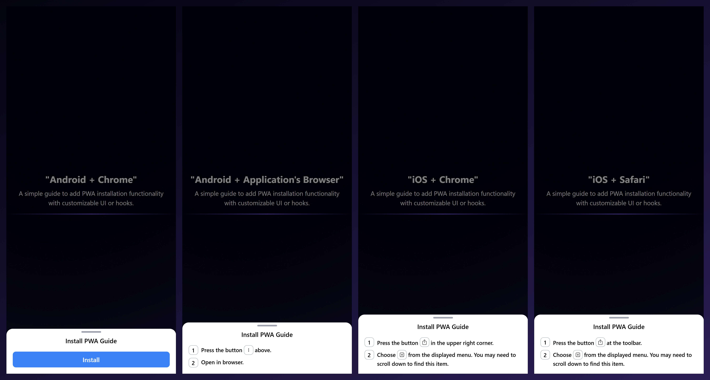

# PWA Install Guide

## Introduction

**PWA Install Guide** simplifies adding Progressive Web App (PWA) installation functionality to your application. The SDK supports two main usage approaches:

1. **Complete Component**: Includes pre-built UI and installation logic.
2. **Hook**: Provides state and data to customize the installation UI as needed.



---

## Installation

Install the SDK via npm:

```bash
npm install pwa-install-guide
```

or yarn

```bash
yarn add pwa-install-guide
```

## Usage

### 1. Complete Component

Use the pre-built component that comes with ready-to-use UI and logic. Ideal for quick integration of PWA installation functionality.

```tsx
import { InstallPWAGuideModal } from '@frontend/pwa-install-guide';
import '@frontend/pwa-install-guide/dist/style.css'


function App() {
  return (
    <div>
      <InstallPWAGuideModal />
    </div>
  );
}
```

#### Props (Optional):

| Prop Name          | Type                         | Description           | Default Value       |
| :----------------- | :--------------------------- | :-------------------- | :------------------ |
| type               | "modal" or "popup"           | Appearence Type       | "modal"             |
| header             | "JSX.Element" or "undefined" | Modal's Header        | "Install PWA Guide" |
| containerClassName | "string" or "undefined"      | ClassName's Container | "undefined"         |

### 2. Using the Hook

The hook provides state and functions for you to create a custom installation UI.

```tsx
import { useInstallPWAGuide } from '@frontend/pwa-install-guide';

function CustomInstallFlow() {
  const { showPrompt, loading, steps, isOpen, onClose } = useInstallPWAGuide({
    iconWrapper: ({ children }) => (
      <span className="icon-wrapper">{children}</span>
    ),
    onAfterInstall: () => alert("PWA installed successfully!"),
    onBeforeInstall: () => console.log("Preparing to install PWA..."),
    onInstallError: (error) => console.error("Installation error:", error),
  });
  if (!steps && !showPrompt) {
    return <p>PWA is installed or not supported on this browser.</p>;
  }
  return (
    isOpen && (
      <div className="modal">
        {steps ? (
          steps.map((step, index) => (
            <p key={index} className="step">
              {index + 1} {step}
            </p>
          ))
        ) : (
          <button onClick={showPrompt} disabled={loading}>
            {loading ? "Loading..." : "Install PWA"}
          </button>
        )}
        <button onClick={onClose}>Close</button>
      </div>
    )
  )
}
```

#### Hook API:

| State/Function | Type                                       | Description                                                       |
| :------------- | :----------------------------------------- | :---------------------------------------------------------------- |
| showPrompt     | "() => Promise&lt;void&gt;" or "undefined" | Function to trigger the PWA installation prompt.                  |
| loading        | "boolean"                                  | Indicates if the installation process is ongoing.                 |
| steps          | "JSX.Element[]" or "undefined"             | List of steps to guide the user through the installation process. |
| isOpen         | "boolean"                                  | Indicates if the installation guide modal is currently open.      |
| onClose        | "() => void"                               | Function to close the installation guide modal                    |

| Prop Name       | Type                                                                   | Description                                                 |
| :-------------- | :--------------------------------------------------------------------- | :---------------------------------------------------------- |
| iconWrapper     | "({ children }:{children: JSX.Element}) => JSX.Element" or "undefined" | Custom wrapper for icons in installation steps.             |
| onBeforeInstall | "() => void" or "undefined"                                            | Callback executed before showing the installation prompt.   |
| onAfterInstall  | "() => void" or "undefined"                                            | Callback executed after successful installation.            |
| onInstallError  | "(error?: unknown) => void" or "undefined"                             | Callback executed when an error occurs during installation. |

## License

ISC Licensed. Copyright (c) Esollabs 2024.
